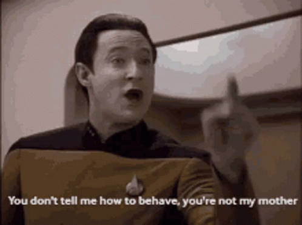

 

   

#

### :robot: Brincadeiras :
  &nbsp;
  &nbsp;
  &nbsp;
  &nbsp;
  &nbsp;
  &nbsp;
  &nbsp;
  &nbsp;
  &nbsp;
  &nbsp;
   &nbsp;

 ### :floppy_disk: Mais usadas :

   

### :computer: Situação :

   

#
### :email: Para contato : 
 

<!---pode-se usar px ou rem para tamanhos no css, recomenda-se rem-->

### :musical_note: Inutilidades:

 
 

